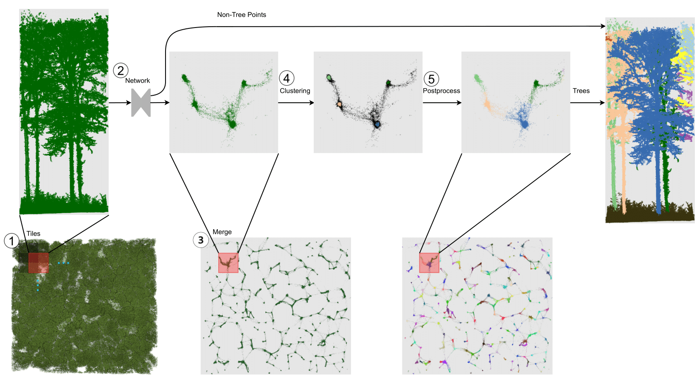

# TreeLearn: A Comprehensive Deep Learning Method for Segmenting Individual Trees from Ground-Based LiDAR Forest Point Clouds



The article is available from [arXiv](https://arxiv.org/abs/2309.08471).

Laser-scanned point clouds of forests make it possible to extract valuable information for forest management. To consider single trees, a forest point cloud needs to be segmented into individual tree point clouds. 
Existing segmentation methods are usually based on hand-crafted algorithms, such as identifying trunks and growing trees from them, and face difficulties in dense forests with overlapping tree crowns. In this study, we propose TreeLearn, a deep learning-based approach for tree instance segmentation of forest point clouds. Unlike previous methods, TreeLearn is trained on already segmented point clouds in a data-driven manner, making it less reliant on predefined features and algorithms. Furthermore, TreeLearn is implemented as a fully automatic pipeline and does not rely on extensive hyperparameter tuning, which makes it easy to use. Additionally, we introduce a new manually segmented benchmark forest dataset containing 156 full trees, and 79 partial trees, that have been cleanly segmented by hand. This is an important step towards creating a large and diverse data basis for model development and fine-grained instance segmentation evaluation. We trained TreeLearn on forest point clouds of 6665 trees, labeled using the Lidar360 software. An evaluation on the benchmark dataset shows that TreeLearn performs equally well or better than the algorithm used to generate its training data. Furthermore, the method's performance can be vastly improved by fine-tuning on the cleanly labeled benchmark dataset. The TreeLearn code is availabe from https://github.com/ecker-lab/TreeLearn. The data as well as trained models can be found at https://doi.org/10.25625/VPMPID.

**[Non-functional]** For a quick demo of the capabilities of TreeLearn without any manual setup, we prepared a google colab notebook: 

**[Non-functional]**  <a target="_blank" href="https://colab.research.google.com/github/ecker-lab/TreeLearn/blob/main/TreeLearn_Pipeline.ipynb">
    
</a> Due to an incompatibility between cuda 12.2 and spconv the colab notebook is currently non-functional. 

## Updates!!
* 【2024/01/16】 Provide a new version of ``model_weights_diverse_training_data.pth`` (can be found [here](https://doi.org/10.25625/VPMPID)) that produces visually more appealing results.
* 【2024/06/19】 Significant speed up of propagation of results to original point cloud.

## Setup

To set up the environment we recommend Conda. If Conda is set up and activated, run the following: 

```
source setup/setup.sh
```

Depending on the specific gpu and cuda version of your system, you might need to adjust the spconv version specified in ``setup/requirements.txt``.


## Segmentation pipeline

All commands should be run while being in the TreeLearn root directory. In the following, we explain how to run the segmentation pipeline on our benchmark dataset L1W. Running the segmentation pipeline on a custom forest point cloud works analogously. You can change the configuration of running the pipeline by editing the configuration file located at ``configs/pipeline/pipeline.yaml``. However, the default configuration should be adequate for the majority of cases.

*1\) Download pre-trained model weights and L1W forest point cloud*
```
python tree_learn/util/download.py --dataset_name model_weights_diverse_training_data --root_folder data/model_weights
```
```
python tree_learn/util/download.py --dataset_name benchmark_dataset --root_folder data/pipeline/L1W/forest
```

*2\) Prepare forest point cloud to be segmented* (This is already fulfilled for L1W)
* The forest point cloud must be provided as a las, laz, npy, npz or a space-delimited txt file. 
* The coordinates must be provided in meter scale and have a minimum resolution of one point per (0.1 m)<sup>3</sup>. It is especially important that the trunks of the trees have a sufficiently high resolution.
* Terrain and low-vegetation points must still be part of the point cloud. Only rough noise filtering has to be performed in advance (e.g. to remove scanned particles in the air). See L1W as an example.
* The point cloud file must be placed in ``data/pipeline/L1W/forest``
* Change the argument 'forest_path' in the pipeline configuration at ``configs/pipeline/pipeline.yaml`` to ``data/pipeline/L1W/forest/L1W.laz``
* We strongly recommend retaining a buffer around the point cloud that is of interest. E.g. for an area of interest of 100 m x 100 m, retain a buffer of ~13.5 m to each side so that input is 127 m x 127 m.
* The pipeline automatically removes the buffer which is only needed as context for network prediction. The xy-shape of the point cloud does not have to be square. Arbitrary shapes are allowed.

*3\) Run segmentation pipeline*
* To execute the segmentation pipeline, run the following command:
```
python tools/pipeline/pipeline.py --config configs/pipeline/pipeline.yaml
```


## Training

Here we explain how to train your own networks for semantic and offset prediction using the automatically segmented point clouds introduced in the paper. Training the network on custom forest point clouds works analogously.

*1\) Download training/validation point clouds and pretrained model weights*
```
python tree_learn/util/download.py --dataset_name automatically_segmented_data --root_folder data/train/forests
```
```
python tree_learn/util/download.py --dataset_name benchmark_dataset --root_folder data/val/forest
```
* Download the pretrained model weights provided by [SoftGroup](https://drive.google.com/file/d/1FABsCUnxfO_VlItAzDYAwurdfcdK-scs/view?usp=sharing). Save the file to ``data/model_weights/hais_ckpt_spconv2.pth``.

*2\) Generate training crops for semantic and offset prediction*
* The forest point clouds from which to generate training data must fulfil the same resolution and noise filtering requirement as in the segmentation pipeline.
* Additionally, the point clouds must contain individual tree and semantic labels. We recommend you to provide the labels as part of .las or .laz files, in which case you need to adhere to the labeling scheme proposed by [this paper](https://doi.org/10.48550/arXiv.2309.01279). See also the description of our [dataset](https://doi.org/10.25625/VPMPID).
* Alternatively, you can provide the point clouds as .npy or .txt files where the first three columns are the x, y and z coordinates and the last column is the label. In this case, unclassified points should be labeled as -1, non-tree points should be labeled as 0, and trees should be labeled starting from 1. Unclassified points are ignored during training.
* To generate random crops from the forest point clouds, run the following command. Please note that generating 25000 random crops as training data takes up a large amount of space (~800Gb). You can adjust the number of crops to be generated in the configuration file.
```
python tools/data_gen/gen_train_data.py --config configs/data_gen/gen_train_data.yaml
```

*3\) Generate validation data for semantic and offset prediction:*
* The forest point cloud used to generate validation data must fulfil the same properties as for the training data.
* To generate tiles used for validation, run the following command:
```
python tools/data_gen/gen_val_data.py --config configs/data_gen/gen_val_data.yaml
```

*4\) Train the network for semantic and offset prediction with the following command:*
```
python tools/training/train.py --config configs/training/train.yaml
```


## Evaluation on benchmark dataset

To evaluate the performance of an arbitrary segmentation method on the benchmark dataset in the same way as in the paper, you need to do the following:

*1\) Download benchmark dataset in voxelized form and evaluated_trees.txt*
```
python tree_learn/util/download.py --dataset_name benchmark_dataset_voxelized --root_folder data/benchmark
```
```
python tree_learn/util/download.py --dataset_name evaluated_trees --root_folder data/extra
```


*2\) Obtain prediction results on the benchmark dataset with an arbitrary method*
* It is ok if the method does not exactly return the same coordinates as in the voxelized benchmark dataset, e.g. different number of points is allowed.
* It only has to be ensured that the coordinates are not in some way shifted because the predictions are propagated to the benchmark dataset using k-nearest-neighbors
* Predictions only have to be made for the inner part of the benchmark dataset but it is also ok if predictions are made for the outer parts
* The prediction results can be supplied as a .las or .laz file with the same labeling scheme as in [this paper](https://doi.org/10.48550/arXiv.2309.01279). See also the description of our [dataset](https://doi.org/10.25625/VPMPID).
* Alternatively, you can provide the prediction results as a .npy or .txt file where the first three columns are the x, y and z coordinates and the last column is the label. In this case, non-tree points should be labeled as 0 and trees should be labeled starting from 1.
* Change the argument 'pred_forest_path' in the evaluate_benchmark configuration at ``configs/evaluation/evaluate_benchmark.yaml`` to where your predicted forest is located.

*3\) Run the evaluation and inspect the evaluation results*
```
python tools/evaluation/evaluate_benchmark.py --config configs/evaluation/evaluate_benchmark.yaml
```
* To take a look at the evaluation results, we prepared a notebook that can be found at ``tools/evaluation/evaluate_benchmark.ipynb``

## Limitations

* Our method requires a sufficiently high resolution of the tree trunks. This requirement might not be fulfilled for point clouds obtained via airborne laser scanning. In case that the trunks are captured well enough, our method might also work for point clouds captured via ALS/UAV.
* Our method requires a sufficiently high context to generate predictions. If the segmentation pipeline is run without removing a buffer of 13.5 meters, segmentation results are expected to not be good at the edges of the point cloud.
* Trees that are smaller than 10 meters will most likely be predicted to belong to the non-tree class. This is because we did not have any training data available where small trees are consistently labeled.
* Although the provided model weights have been trained on diverse data (see description of our [dataset](https://doi.org/10.25625/VPMPID)), it has not been trained and tested on all forest types, such as tropical forests. We cannot make any assessment about the performance of TreeLearn in such cases.


## Acknowledgements

The code is built based on [SoftGroup](https://github.com/thangvubk/SoftGroup) and [spconv](https://github.com/traveller59/spconv).
